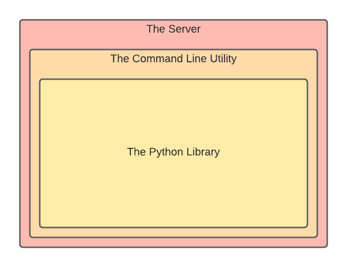

# IMS Logger
___

## Jump to a Solution
| [The Server](/server) | [The Command Line Utility](/cmd) | [The Python Library](/py) |
|----|----|----|

## Introduction

**IMS Logger** is a project aimed at making PLC logging easy for a fraction of the cost of an IBA. It has three solutions: [*The Server*](server), [*The Command Line Utility*](cmd), and [*The Python Library*](py). They are structured as follows:

